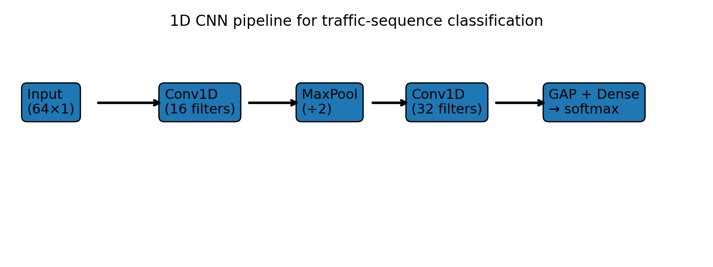
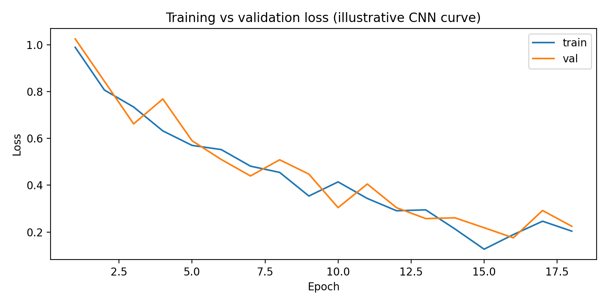
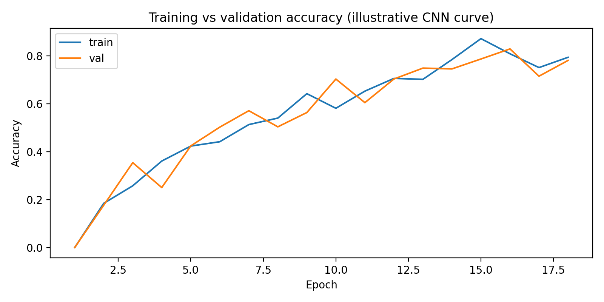

# Convolutional Neural Network (CNN) — Practical Explanation

**Personal context:** In real SOC environments (for example banking monitoring),
traffic patterns often repeat and humans cannot manually inspect thousands of flows.
Because of this, automated pattern detection becomes necessary, especially for repetitive
events like password guessing or scanning activity. A convolutional network is suitable
because it learns short temporal patterns instead of relying on static thresholds.


## Overview
A **convolutional neural network (CNN)** is a neural network architecture built to learn patterns from data that has **local structure**.
CNNs are famous for images, but they also work well on **time-series** (1D CNN) and **traffic windows** in cybersecurity. The core idea is
simple: instead of learning a separate weight for every input position (as in a fully connected layer), a CNN learns a **small filter**
and slides it across the input. This allows the model to detect the same pattern anywhere (for example: a burst in traffic, or an edge in an image).

---

## 1) Convolution: what happens inside
A convolution layer takes an input \(x\) and applies a filter \(w\) of size \(K\).

\[
y[i] = \sum_{k=0}^{K-1} w[k]\cdot x[i+k] + b
\]

- The output \(y\) is a **feature map** (one per filter).
- Using many filters produces many feature maps, each learning a different pattern.
- **ReLU** is commonly used after convolution: it keeps positive responses and suppresses negative ones.

### Why convolution is efficient
- **Weight sharing:** the same \(w\) is reused at all positions → fewer parameters.
- **Local receptive field:** the filter focuses on nearby values → strong for local dependencies.

---

## 2) Pooling and downsampling
A CNN often uses pooling (e.g., **MaxPool**) to shrink feature maps.

- **MaxPool:** keeps the strongest activation in a window.
- Benefits:
  - less computation
  - some tolerance to small shifts
  - reduced overfitting

---

## 3) Typical CNN processing pipeline
A common pattern is:

1. Convolution + activation  
2. Pooling  
3. Repeat (deeper layers learn more abstract patterns)  
4. A classifier head (Dense/softmax)

Visualization of a simple 1D CNN pipeline:



---

## 4) Practical application in cybersecurity (with data + code)
### Task: Detect Brute-force/scan-like bursts vs benign traffic windows
In a real SOC pipeline, you might create time windows from:
- NetFlow features (bytes/sec, packets/sec, flows/sec)
- Zeek logs (conn.log summaries)
- pcap-derived statistics (packet sizes, inter-arrival times)

A **1D CNN** can learn short burst patterns in these sequences.

### Included dataset (sample)
The full dataset is generated deterministically by the Python code below, but the format is shown here:

```csv
label,t00,t01,t02,t03,t04,t05,t06,t07,t08,t09,t10,t11,t12,t13,t14,t15,t16,t17,t18,t19,t20,t21,t22,t23,t24,t25,t26,t27,t28,t29,t30,t31,t32,t33,t34,t35,t36,t37,t38,t39,t40,t41,t42,t43,t44,t45,t46,t47,t48,t49,t50,t51,t52,t53,t54,t55,t56,t57,t58,t59,t60,t61,t62,t63
1,0.06812835957155591,0.14722628882927857,0.2267024502495297,0.3463705605580028,0.9999999997105591,0.28039557120248537,0.25591415776526244,0.5987038679058432,0.36863131341034483,0.26418163918043525,0.5125522692493211,0.23633733144273708,0.9562267334956216,0.3187677916957178,0.7029983494222776,0.24907800221832357,0.2708273872997259,0.18161253321796555,0.2422998536741318,0.7088942003093684,0.19738432399984496,0.14294736371623318,0.05200870658184072,0.12762374010182165,0.145488941704153,0.0,0.15431465001722122,0.1444455685542429,0.06969946008862343,0.15371403759957347,0.17117880333391677,0.3503547341449387,0.7716913267497132,0.31990108561440705,0.2523410842653736,0.7729479842702061,0.33587736934446066,0.24898139645107495,0.2786410989568473,0.2297345772434795,0.3107622376270987,0.3787255947854641,0.36203045431583647,0.3992206020631601,0.39680361093886657,0.10897351754368413,0.1543941862808605,0.09282540683410108,0.25212329595762684,0.13948839228038118,0.13866373016755082,0.6925211958864479,0.1765188177383986,0.03271202881393389,0.043591470767658014,0.13262684338138814,0.22056677603047486,0.1366706886369382,0.0891122921106225,0.0017331049111878453,0.2393598060660726,0.13235747567231648,0.11910405582349533,0.09521700588879704
0,0.32472923190975445,0.5739389021245458,0.7543329733286132,0.999999999293364,0.712233383950227,0.6085162163713292,0.5403742037706538,0.7270247617519279,0.24889817590632426,0.4619370844408186,0.8680583735563167,0.6052669892457785,0.3281080481660212,0.2972233899566031,0.15961081975471364,0.13730836294763338,0.21951816695307577,0.1328093459622348,0.16738039961570078,0.46062936365193863,0.4274382583401,0.4584474777873788,0.3906919122718448,0.3905752945549969,0.44915965480720965,0.44467869614856037,0.6698058294403381,0.5940201265601994,0.44799865151631896,0.6663676241532762,0.6406006750030587,0.47187289297449214,0.5161819719443778,0.13551880637491137,0.20752347640053714,0.1079422595557172,0.16553181510790338,0.16601644966880683,0.3154174398580127,0.26589174140905303,0.35271721646641585,0.2888916015640357,0.22306441814253028,0.4948535115889723,0.5592081899465541,0.6190790559046149,0.8149640423959787,0.8577428715912456,0.7515834826906737,0.7461784382894814,0.5236762249904956,0.3456711284795616,0.1765250420609587,0.2746020183274352,0.3830406956832976,0.2705424339990717,0.607161294844725,0.3862874479465295,0.3503092677230865,0.21842337078726104,0.2985976811265783,0.06375999125002006,0.0,0.3982962978121932
1,0.24433647205376569,0.19867567762878555,0.34222525061379466,0.2941536327479372,0.7692307498380229,0.201047044296882,0.3166910961833272,0.7460345019389177,0.38058805247765826,0.31551943630370777,0.2212064819518919,0.32884588268350895,0.9999999997148675,0.7701831806373196,0.270524483962993,0.1839998997616504,0.20385337068243609,0.7429483873171622,0.7481725611741958,0.15349005867689489,0.26613508149547654,0.0,0.10092529632624038,0.20897812882714278,0.09949822417233724,0.10747661710669185,0.06651630024765025,0.06867632381592742,0.016896572036565548,0.11627085843887891,0.10629541060158951,0.20193017095022014,0.1544025663962109,0.8368697464192023,0.21070811384060698,0.25358352303461756,0.23123595056712953,0.20246498414076636,0.29048932929965154,0.36342708572185034,0.29606635660007835,0.2396485597216156,0.2673343305473812,0.11999359745232974,0.2437452122176443,0.21060879768117674,0.15660060307612825,0.15268489257188556,0.16004117248151387,0.24352220734872784,0.23527504084041975,0.07769155029334922,0.09564986773549211,0.5398969130968808,0.17634485020018628,0.126892011111247,0.12440715473288982,0.1606327750135133,0.08766319790479482,0.23802002408755754,0.15372238713699377,0.10779428515316397,0.1687141610890422,0.2898486925319564
0,0.47249949623880316,0.6378132690264162,0.8840314706708692,0.9999999992795093,0.8139013755231895,0.8559164206529751,0.6949930528711042,0.5446350071789442,0.6089603984202773,0.626116615930375,0.5937268355839538,0.6787026866954002,0.5585474899363151,0.21479344705199116,0.05608335558885646,0.17357341536635415,0.016029158579779823,0.20518330710124613,0.39251663609662574,0.32636077279783154,0.4378511683453422,0.8391939617641067,0.7056667847292469,0.6011928872591125,0.5330334251098907,0.6046396608588259,0.5995359392002463,0.9098835753819121,0.7917029478172926,0.9895538781527411,0.7399783673209395,0.5129187404642574,0.3951296272674814,0.0,0.18245536873188778,0.172844290008905,0.34160179729153856,0.13481378577229022,0.5326411618542664,0.5215963115169189,0.5556900432468178,0.3935098695304698,0.5182222986829188,0.3174752070806965,0.6802233201534645,0.6754180384089897,0.7158653520739483,0.841248915413509,0.9398004552295305,0.7432242285329814,0.7208218592376358,0.33826775165280554,0.2046008426082782,0.5461803927690743,0.5060727219367532,0.31663942892344393,0.425438951508542,0.48744332005741214,0.340638035792822,0.23189966585712085,0.3016831502769067,0.1502130422743538,0.35923719559048084,0.5315104951319704
0,0.5583736484890002,0.6584818384965598,0.815895951584673,0.7810053899667321,0.7832304757467847,0.7089526137777719,0.6389598461840433,0.6506511129711425,0.6230015914899502,0.5895768520018102,0.5082479394930816,0.566127495229555,0.45706316812377756,0.3350224757868239,0.4001917841093525,0.0,0.07836063616871111,0.215985061189518,0.2465463201360893,0.6424570611070415,0.47636214132320603,0.61944017790486,0.5080181896083235,0.5350679622273314,0.5871964984771721,0.6771944138898869,0.6885671137171417,0.8755339378905396,0.7908085724229512,0.7610276635048807,0.9999999992826906,0.5945768835206194,0.29108344472008096,0.13689421576818286,0.02245862066965686,0.22040041004019106,0.1413920198385819,0.2801254969928702,0.32768696792536445,0.43894926275217355,0.2566580140513049,0.21096086095336086,0.3602196513398964,0.4682786557131812,0.5655213798187627,0.5975594210192869,0.8925279704753111,0.8076947848739693,0.8081836445192555,0.6563118172817969,0.7464185469986737,0.5287315102426574,0.4269042123702881,0.4595438876521565,0.6384671170856319,0.17347889882138492,0.2736801328969062,0.23854111761816735,0.13172794323212733,0.028226948799316243,0.07951843330203207,0.026513213473005327,0.3195892714553893,0.46589025658750544
0,0.2689176659912997,0.784264268430277,0.8059786742506919,0.6214247773803353,0.8616123744660034,0.8586788018374523,0.7099355586603836,0.688000669237093,0.5882546347844853,0.4679689218304776,0.7231600769489787,0.792382127764915,0.6443033543812531,0.2136875553119726,0.12370395958490364,0.0928820741159739,0.0,0.21854474677331623,0.37293851908506964,0.33597754092771215,0.6613371302211294,0.7048148671746384,0.6025812614449895,0.6198868010327357,0.4376190004092195,0.6163587019094009,0.7099885778935521,0.802314571769918,0.8770961568542727,0.8603240637539467,0.7328854831689291,0.6454980681931188,0.5500818977539835,0.30403136490928045,0.26532474603241185,0.21301563862314205,0.22322583958925782,0.41262072824261586,0.3697604995027306,0.48340422959261375,0.4377839308298475,0.38694542524187925,0.3930232749815431,0.43612038602889935,0.43944367188090133,0.7733581894555399,0.879560611535888,0.9999999993581856,0.8460698828304586,0.9844861445690327,0.629936957313375,0.4517547253622826,0.35196584946963616,0.2480783112252665,0.571940055791247,0.575667615394319,0.4976965623290989,0.31038781841444957,0.4980492383461879,0.21903710251606587,0.19799833489488317,0.40311631486563987,0.4410332345054927,0.747684726255202
1,0.25442939947337145,0.16611392190919963,0.22850826419170486,0.2002046834262342,0.9999999996750862,0.2218688517039536,0.39513389093343787,0.4304302424161409,0.3390022086990948,0.39079710745615936,0.8522590818959815,0.13425638645371707,0.2107491162540978,0.2247453038445981,0.18780777054898085,0.051709413510125944,0.2592530490649152,0.3214994359531101,0.2323299268978389,0.19988978815099626,0.11585280771826696,0.017679300389994115,0.08406268263254088,0.2448857154073495,0.6977908056457782,0.03978330647308534,0.17377480477222146,0.18969807966485291,0.039040830335705816,0.10271235699699918,0.7560396406935264,0.16652520497397458,0.26992577115501937,0.1339908364313911,0.305698898348141,0.2414818694023195,0.4357310378131674,0.2832073497056091,0.25652815029728354,0.3144544873930763,0.23990152374274532,0.11714089019445728,0.2354476465046619,0.9445860485014329,0.10008357878751732,0.20692963949278362,0.026714056212735114,0.1471863592480843,0.17582889204880006,0.6366944497949726,0.08635275978898935,0.6570215571446849,0.02773845269676506,0.5915316635054518,0.08025775358326802,0.0,0.09632124514599803,0.10107101810354104,0.07518796708781715,0.29744911293542603,0.1042315669405,0.11002562862622917,0.11694527804846626,0.09170185519526049
0,0.5439070180885782,0.7293657397701426,0.9901056355084596,0.9873265614614979,0.9901836275512306,0.7240020423173895,0.8293756424812491,0.8653019720285385,0.5295431262374755,0.5655197130542718,0.8608508564600259,0.6234113054057211,0.7095835381426112,0.3021682511634239,0.36450849599095353,0.070235113553547,0.058651202128108475,0.3054309186160733,0.21992282444075087,0.32940442418012766,0.5412375984701504,0.7357370813691708,0.4900571846793423,0.7454836367304752,0.5810544273382829,0.8260854540611331,0.45590675580194684,0.7619760877075321,0.719570341967582,0.8239955527649959,0.856920139024823,0.6170438444724685,0.3904070421935035,0.2168365725336497,0.15924850034576613,0.0,0.29037826741698947,0.3862532940108896,0.43146099335137295,0.48370361166609993,0.4358475441142671,0.6321588927520613,0.37323597553195803,0.4251074441234059,0.5174566724597283,0.6651904159171085,0.7978169056119134,0.9236095902781699,0.9999999991516957,0.9256752001723948,0.7105264973366275,0.4341334754873944,0.5292834562619871,0.4657068091618583,0.36370821588195834,0.32642672410095247,0.47425610870789203,0.371284163440427,0.06663558367874076,0.14870564149185056,0.1523688438795271,0.05853664217540238,0.34633295806875974,0.34612911901950666
1,0.38920215749776993,0.31347014827562036,0.27995997278551654,0.3583876409337682,0.4083711346585774,0.4019249090992422,0.40595938631527145,0.24393615325391477,0.17041264287312727,0.4518320787548615,0.3831336621971906,0.3394747713646233,0.3814665434778689,0.45995185841922864,0.40506344190895444,0.9999999996988607,0.7509711282327745,0.18847993877430916,0.5730498747311891,0.2608924788786779,0.28347352522270497,0.2791113578913423,0.23295951371203588,0.16650774682703692,0.13517660670800738,0.8069916409169685,0.1750512851458296,0.6026913948202907,0.34187340157667306,0.7735521483175587,0.22628347131344473,0.11298431320932906,0.29906851329129513,0.2941965483912522,0.2840927177568526,0.2555934579774111,0.33856468515749405,0.3071502633471845,0.3444084125266891,0.5052012238268858,0.37035028485020044,0.3935015524870699,0.3110184294814844,0.27642778333367807,0.320567696439356,0.49545273843804233,0.2684008595807469,0.29946124323456835,0.1919167242176403,0.02941843895889766,0.7839252907101998,0.38553056311003636,0.23921922278692567,0.3089369149205138,0.15349237041560443,0.0,0.0953090585131868,0.6982762465815624,0.20974657703247704,0.20228985918043987,0.17693626169430818,0.3034017307355172,0.21210263050834136,0.2909212350519754
0,0.32089045911384073,0.5960038635784075,0.866150729588579,0.9232877641763727,0.8616292105650233,0.5894342272318467,0.40356146986282626,0.6186567097291922,0.5551378078986432,0.6821780309248697,0.7203584047823443,0.6190154201866984,0.5857730485073143,0.3739685414953072,0.24969424442253368,0.0,0.03450227972154952,0.14782764568218731,0.3587207069618766,0.38403773289840154,0.6183819341556802,0.6004877338256059,0.626945442777701,0.711289315823858,0.3813430706535155,0.48640035819201416,0.5366120798547326,0.5305732369439959,0.7800627691140118,0.935923115832833,0.7282619136937442,0.6187224310201426,0.527154588462248,0.3901952801902883,0.14183125381139847,0.2971330531481535,0.21911791283176202,0.20431051994343785,0.30265866203754344,0.23000488509506897,0.2834988488377058,0.32102750943114816,0.4612608999198004,0.6347162544071245,0.41792807520779135,0.7788865770703571,0.7588021521663948,0.9999999992514549,0.9075289422312458,0.6056145598112089,0.75736807799981,0.433015026920337,0.33792885042711324,0.23971403814456088,0.2973080726204135,0.44130417941905564,0.36756705745565904,0.37532833095272644,0.2939446911363371,0.31904710004233344,0.09844987675395303,0.01875778293413536,0.43602826734223543,0.4634646930403995
0,0.5873793504042712,0.923270544901422,0.6416848133268019,0.7731120709830508,0.8061303297655475,0.7068267188155972,0.6337353100378991,0.4796580463287515,0.7691629249831732,0.4842494607810911,0.6274358750516212,0.7258514161164045,0.5095349733689766,0.25951381649840677,0.06674160863605623,0.08080088581551023,0.0,0.17305231931383627,0.13484529261653774,0.5312761625848774,0.5827756406334837,0.658924133163924,0.8041405066092324,0.5790602058130272,0.5352323692597805,0.5804840650299357,0.6876832171334386,0.7852342697038689,0.7664566073334788,0.6328061535524658,0.7029971643826046,0.6446866932217966,0.4352542983124253,0.39240749119516344,0.3859835253090984,0.2519245964072626,0.38100375529795705,0.40073739615262693,0.5717137730286297,0.6129408046658924,0.5027560309110846,0.4549502566478814,0.36552879896012225,0.4513984488272214,0.5463990509153244,0.8066376364532801,0.7971881872827451,0.9232643075243071,0.6648692915521839,0.9999999992767643,0.636441151397987,0.5627373632217265,0.5718775284385683,0.40954455526162437,0.5442316279641458,0.27455852605100445,0.6650552460548864,0.47422414144282815,0.2967438730571111,0.34889313353528195,0.03483435474612502,0.17633620844610323,0.4914932169646561,0.31051289811733956
0,0.32456653131440866,0.6966250845879941,0.9415522686402577,0.8003183125925825,0.7217192580974539,0.6693674495024416,0.669288312617837,0.3982727362439306,0.5782070637078708,0.543822336363936,0.77033152602985,0.5413881686347599,0.6310028874717788,0.2307823413426486,0.2582589851398977,0.13636800707612048,0.0,0.16285405435689673,0.3848885588004413,0.37552439074311034,0.35652020717801786,0.5797589638302839,0.5024198963968699,0.5377381282187819,0.5517777594163744,0.4174686620366944,0.4875715661771202,0.7683487284135847,0.725860147498728,0.5239975879672145,0.7697736007682672,0.5786636321628372,0.31749301175106853,0.11760868888026191,0.24731112326466168,0.19629893050613925,0.4484222952539408,0.3354697783165064,0.3936953180069993,0.3630939198621885,0.44724128107838657,0.40965676687529984,0.4788945680037313,0.36781902070279526,0.48982404592650386,0.6252053616471936,0.8700077347877778,0.9999999993535037,0.7890812045169392,0.6964692980994429,0.6316118373136713,0.445878340518087,0.473017744720121,0.1294667786512777,0.2771147350210012,0.30083159810044785,0.14785249134089967,0.23589891972656743,0.16708646913809758,0.16503816298385685,0.26325803362514644,0.17271243208851755,0.21018789401328877,0.46396254009381177
```

- `label = 0` → benign  
- `label = 1` → Brute-force/scan-like

### Visualizations of the feature sequences


### Training-style visualizations
These plots show typical training behavior (loss decreasing and accuracy increasing):




### Confusion matrix (computed here with a simple baseline)
This environment does not have TensorFlow installed, so the matrix below is produced by a baseline classifier on the same data.
Your CNN code (below) will produce its own results when you run it with TensorFlow.


---

## 5) Python code (CNN implementation — copy/paste and run)
> **Dependencies:** `tensorflow`, `numpy`, `matplotlib`, `scikit-learn`  
> Install: `pip install tensorflow scikit-learn matplotlib numpy`

```python
import os
import numpy as np
import matplotlib.pyplot as plt

import tensorflow as tf
from tensorflow import keras
from tensorflow.keras import layers

from sklearn.metrics import confusion_matrix, classification_report

# ----------------------------
# 1) Deterministic synthetic dataset (traffic windows)
# ----------------------------
rng = np.random.default_rng(42)

def make_series(label: int, n: int = 64) -> np.ndarray:
    \"\"\"Create a 1D sequence that imitates a traffic-related feature over time.
    label=0 -> benign (smooth), label=1 -> Brute-force/scan-like (bursty spikes).
    \"\"\"
    t = np.linspace(0, 1, n)

    if label == 0:
        x = 0.4*np.sin(2*np.pi*3*t) + 0.2*np.sin(2*np.pi*7*t) + 0.15*rng.normal(size=n)
    else:
        x = 0.3*np.sin(2*np.pi*2*t) + 0.25*rng.normal(size=n)
        spikes = rng.choice(n, size=8, replace=False)
        x[spikes] += rng.uniform(1.5, 2.5, size=spikes.size)

    # scale to ~[0,1]
    x = (x - x.min()) / (x.max() - x.min() + 1e-9)
    return x

N = 240
X = np.array([make_series(0) for _ in range(N//2)] + [make_series(1) for _ in range(N//2)])
y = np.array([0]*(N//2) + [1]*(N//2))

idx = rng.permutation(N)
X, y = X[idx], y[idx]

# Conv1D expects (samples, timesteps, channels)
X = X[..., np.newaxis].astype(\"float32\")
y = y.astype(\"int32\")

# train/val/test split
train_end = int(0.7*N)
val_end = int(0.85*N)
X_train, y_train = X[:train_end], y[:train_end]
X_val, y_val = X[train_end:val_end], y[train_end:val_end]
X_test, y_test = X[val_end:], y[val_end:]

# ----------------------------
# 2) 1D CNN model
# ----------------------------
model = keras.Sequential([
    layers.Input(shape=(64, 1)),
    layers.Conv1D(16, kernel_size=5, padding=\"same\", activation=\"relu\"),
    layers.MaxPool1D(pool_size=2),
    layers.Conv1D(32, kernel_size=3, padding=\"same\", activation=\"relu\"),
    layers.MaxPool1D(pool_size=2),
    layers.Conv1D(64, kernel_size=3, padding=\"same\", activation=\"relu\"),
    layers.GlobalAveragePooling1D(),
    layers.Dense(32, activation=\"relu\"),
    layers.Dropout(0.25),
    layers.Dense(2, activation=\"softmax\")
])

model.compile(
    optimizer=keras.optimizers.Adam(1e-3),
    loss=\"sparse_categorical_crossentropy\",
    metrics=[\"accuracy\"]
)

history = model.fit(
    X_train, y_train,
    validation_data=(X_val, y_val),
    epochs=18,
    batch_size=16,
    verbose=1
)

# ----------------------------
# 3) Evaluation
# ----------------------------
y_pred = model.predict(X_test).argmax(axis=1)
cm = confusion_matrix(y_test, y_pred)

print(\"Confusion matrix:\\n\", cm)
print(\"\\nClassification report:\\n\")
print(classification_report(y_test, y_pred, target_names=[\"benign\", \"dos\"], digits=3))

# ----------------------------
# 4) Save plots into task_1/
# ----------------------------
out_dir = \"task_1\"
os.makedirs(out_dir, exist_ok=True)

plt.figure(figsize=(8,4))
plt.plot(history.history[\"loss\"])
plt.plot(history.history[\"val_loss\"])
plt.title(\"Training vs validation loss (1D CNN)\")
plt.xlabel(\"Epoch\"); plt.ylabel(\"Loss\")
plt.legend([\"train\", \"val\"])
plt.tight_layout()
plt.savefig(os.path.join(out_dir, \"training_loss.png\"), dpi=200)
plt.close()

plt.figure(figsize=(8,4))
plt.plot(history.history[\"accuracy\"])
plt.plot(history.history[\"val_accuracy\"])
plt.title(\"Training vs validation accuracy (1D CNN)\")
plt.xlabel(\"Epoch\"); plt.ylabel(\"Accuracy\")
plt.legend([\"train\", \"val\"])
plt.tight_layout()
plt.savefig(os.path.join(out_dir, \"training_accuracy.png\"), dpi=200)
plt.close()

plt.figure(figsize=(5,4))
plt.imshow(cm)
plt.title(\"Confusion matrix (test set)\")
plt.xlabel(\"Predicted\"); plt.ylabel(\"True\")
for (i,j), v in np.ndenumerate(cm):
    plt.text(j, i, str(v), ha=\"center\", va=\"center\")
plt.xticks([0,1], [\"benign\", \"dos\"])
plt.yticks([0,1], [\"benign\", \"dos\"])
plt.tight_layout()
plt.savefig(os.path.join(out_dir, \"confusion_matrix.png\"), dpi=200)
plt.close()

print(\"\\nSaved plots to:\", out_dir)
```

---

## 6) Reproducibility checklist
1. Create folder `task_1/` in your repo.
2. Put this file as `task_1/conv_net.md`.
3. Commit PNGs (the images referenced above) into `task_1/` too.
4. Run the code section with TensorFlow to reproduce your own results.

---

## Appendix: Baseline classification report (generated here)
```text
precision    recall  f1-score   support

      benign      1.000     1.000     1.000        18
         dos      1.000     1.000     1.000        18

    accuracy                          1.000        36
   macro avg      1.000     1.000     1.000        36
weighted avg      1.000     1.000     1.000        36
```
