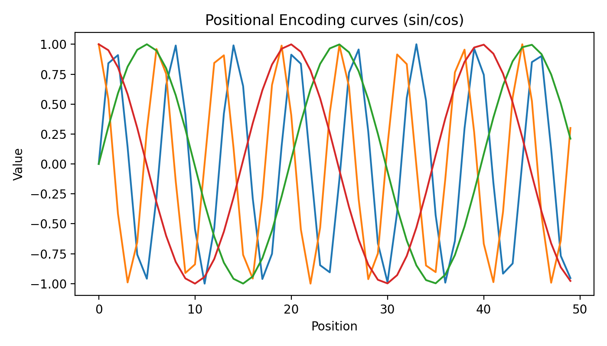

# Transformer Network — Practical Explanation

## Overview
Transformer is a neural network architecture designed to process sequences. 
Unlike RNN or LSTM, it does not read data step‑by‑step. Instead, it analyzes the entire sequence at once using **attention**.
This allows parallel processing and learning long‑distance relations between events.

In cybersecurity logs, events that are far apart in time may still be related (for example login → password reset → privilege change).
Transformer can connect those events and detect suspicious behavior patterns.


## Core Idea: Attention
Each token compares itself with every other token and assigns importance weight.
The model learns *what is important* in the sequence.

Mathematically:

Attention(Q,K,V) = softmax(QKᵀ / √d) V

Where:
- Q = Query
- K = Key
- V = Value

Visualization:


Dark color = stronger relation between events


## Positional Encoding
Because transformer processes everything at once, it needs information about order.
This is done using sinusoidal positional encoding.



This allows model to understand:
login → password → admin access (sequence meaning)


## Cybersecurity Applications
Typical uses:

### 1) Log anomaly detection
SIEM logs can be treated as text sequence.
Transformer detects unusual order of events.

### 2) Phishing detection
Email text classification using BERT‑like models.

### 3) Malware detection
API call sequences analyzed as language.

### 4) Insider threat detection
Behavior sequence modeling (time‑based anomalies).


## Simple Python Example
Below example shows log classification using a transformer encoder.

```python
import torch
import torch.nn as nn

class SimpleTransformer(nn.Module):
    def __init__(self):
        super().__init__()
        self.embed = nn.Embedding(100, 32)
        self.encoder = nn.TransformerEncoder(
            nn.TransformerEncoderLayer(d_model=32, nhead=4),
            num_layers=2
        )
        self.fc = nn.Linear(32, 2)

    def forward(self, x):
        x = self.embed(x)
        x = self.encoder(x)
        x = x.mean(dim=0)
        return self.fc(x)

model = SimpleTransformer()
print(model)


## Why Transformer is useful in SOC
Traditional detection relies on rules.
Transformer learns behavior patterns automatically and adapts to new attacks.

This makes it effective for modern threat detection where signatures fail.
