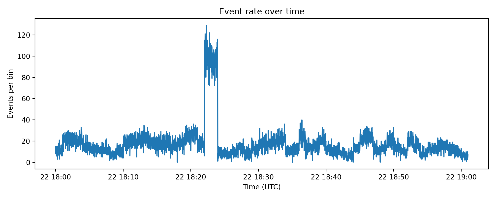
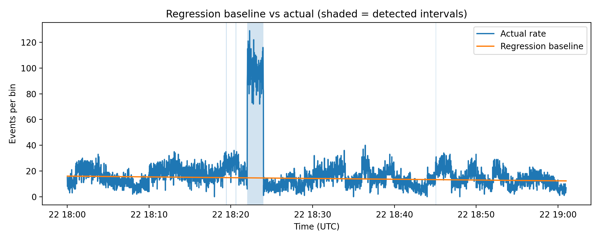
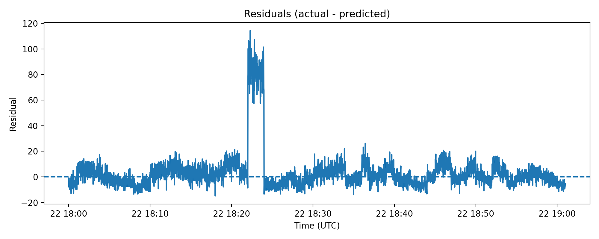

# DDoS Detection Report (Regression-Based)

## 1) Files in this folder (GitHub: `task_3/`)
- **Event log:** `g_gzirishvili25_72345_server.log`  
- **Source code:** `code.py`  
- **Outputs (generated by the script):** `out/`
  - `out/ddos_intervals.csv`
  - `out/timeseries.csv`
  - `out/rate_plot.png`
  - `out/regression_plot.png`
  - `out/residuals_plot.png`
  - `out/run_summary.txt`
- **Execution proof screenshot:** `Screenshot 2026-02-12 203620.png`

> **Log link (same folder):** `./g_gzirishvili25_72345_server.log`  
> (In GitHub, this becomes a clickable link automatically.)


## 2) What was done (clear summary)
1. Parsed timestamps from the event log.
2. Aggregated events into a per-second time series (**events per 1 second**).
3. Fitted a **linear regression baseline** to model “normal” traffic trend.
4. Marked anomalies where observed traffic is significantly higher than the baseline.
5. Merged adjacent anomaly points into continuous **DDoS intervals**.
6. Generated visualizations and CSV outputs for reproducibility.


## 3) How to reproduce (step-by-step)
Open a terminal inside the `task_3/` folder and run:

```bash
python code.py --log g_gzirishvili25_72345_server.log --out out
```

Optional tuning (if needed for other logs):
- Change time bin size: `--freq 5S` or `--freq 1Min`
- Make detection more/less sensitive:
  - `--z-threshold 2.5` (more sensitive)
  - `--ratio-threshold 1.8` (more sensitive)

## 4) Evidence the script was executed


## 5) Regression approach (why regression is used here)
### 5.1 Build a traffic rate time series
From raw events, we count how many events happen in each time bin (1 second).  
This converts the log into a numerical series suitable for ML/regression.

### 5.2 Fit a baseline using Linear Regression
We model the expected traffic level as:

\[
\hat{y}(t) = a \cdot t + b
\]

Where:
- \(t\) is the time index (0, 1, 2, ...)
- \(\hat{y}(t)\) is the predicted “normal” traffic rate
- spikes above this baseline indicate possible DDoS bursts

To avoid the baseline being “pulled up” by attack spikes, the fit excludes the top quantile of the highest points.

### 5.3 Detect anomalies
A time bin is flagged as attack if **either** condition is true:
- residual z-score ≥ threshold  
- actual/predicted ratio ≥ threshold

Then we merge close detections into continuous time intervals.


## 6) Results — detected DDoS interval(s)
The detected intervals are stored in:
- `out/ddos_intervals.csv` (main machine-readable result)

### Intervals (UTC)
| # | Start (UTC) | End (UTC) | Duration |
|---:|---|---|---:|
| 1 | 2024-03-22 18:19:24+00:00 | 2024-03-22 18:19:30+00:00 | 6 sec |
| 2 | 2024-03-22 18:20:35+00:00 | 2024-03-22 18:20:41+00:00 | 6 sec |
| 3 | 2024-03-22 18:22:01+00:00 | 2024-03-22 18:24:00+00:00 | 119 sec |
| 4 | 2024-03-22 18:45:02+00:00 | 2024-03-22 18:45:07+00:00 | 5 sec |

> If you re-run with different thresholds or bin size, the interval edges may slightly shift.  
> The official outputs for this submission are the CSV + PNG files committed to GitHub.

## 7) Relevant visualizations
### 7.1 Event rate over time


### 7.2 Regression baseline vs actual (shaded intervals = detected DDoS)


### 7.3 Residuals (actual − predicted)



## 8) Main fragments of the developed source code
Full code is in `code.py`. Below are the main parts that implement the solution.

### 8.1 Command-line arguments and inputs
```python
ap.add_argument("--log", required=True, help="Path to provided event log file")
ap.add_argument("--out", required=True, help="Output folder")
ap.add_argument("--freq", default="1S", help="Resample frequency")
ap.add_argument("--z-threshold", type=float, default=3.0)
ap.add_argument("--ratio-threshold", type=float, default=2.0)
args = ap.parse_args()
```

### 8.2 Timestamp extraction and per-second rate series
```python
def build_rate_series(ts: pd.Series, freq: str) -> pd.Series:
    ts = ts.dropna().sort_values()
    idx = pd.DatetimeIndex(ts)
    s = pd.Series(1, index=idx).resample(freq).sum().fillna(0.0)
    return s
```

### 8.3 Regression baseline fit (excluding top spikes)
```python
y = rate.values.astype(float)
x = np.arange(len(rate)).reshape(-1, 1).astype(float)

cutoff = np.quantile(y, train_quantile)
mask = y <= cutoff

model = LinearRegression()
model.fit(x[mask], y[mask])

y_pred = model.predict(x)
residuals = y - y_pred
```

### 8.4 Anomaly detection logic (z-score OR ratio)
```python
resid_std = np.std(residuals) + 1e-9
z = residuals / resid_std

pred_safe = np.maximum(y_pred, 1e-6)
ratio = rate.values / pred_safe

is_anom = (z >= z_threshold) | (ratio >= ratio_threshold)
```

### 8.5 Merge anomalies into continuous intervals
```python
true_idx = np.where(is_anom)[0]
# group indices with a configurable merge gap
# then keep only groups longer than min_interval_seconds
```

### 8.6 Save outputs and plots
```python
out_ts.to_csv(os.path.join(args.out, "timeseries.csv"), index=False)
out_int.to_csv(os.path.join(args.out, "ddos_intervals.csv"), index=False)

plt.savefig(os.path.join(args.out, "rate_plot.png"), dpi=200)
plt.savefig(os.path.join(args.out, "regression_plot.png"), dpi=200)
plt.savefig(os.path.join(args.out, "residuals_plot.png"), dpi=200)
```

## 9) Notes
- This approach is intentionally **reproducible**: the report + code + log + outputs are all in one folder.
- If the log format changes (CSV/JSONL vs text), `code.py` can auto-detect or you can specify `--time-col`.

